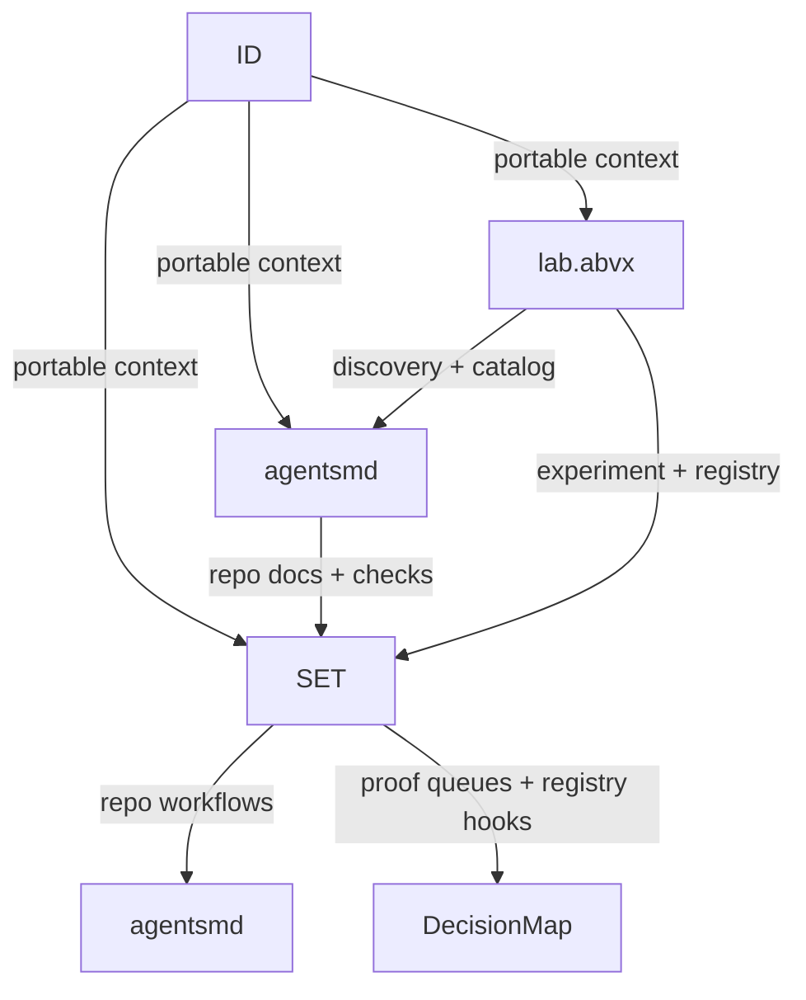

# Ecosystem Map

This map keeps dependencies explicit:

- `ID` defines portable human context and trust/freshness semantics.
- `SET` is orchestration, scheduling, and repo control.
- `agentsgen` is repository surface/document generation for agents and hooks.
- `lab.abvx` is the discovery/catalog layer for ecosystem entry.
- `DecisionMap` is an optional decision strategy companion.
