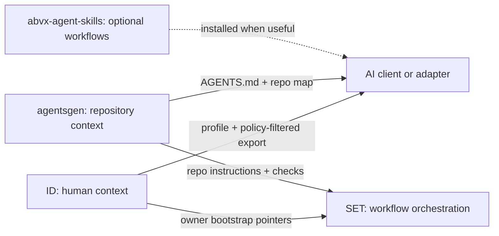

# Ecosystem map

```mermaid
flowchart LR
    ID[ID: human context]
    agentsgen[agentsgen: repository context]
    SET[SET: workflow orchestration]
    skills[abvx-agent-skills: optional workflows]
    client[AI client or adapter]

    ID -->|profile + policy-filtered export| client
    agentsgen -->|AGENTS.md + repo map| client
    ID -->|owner bootstrap pointers| SET
    agentsgen -->|repo instructions + checks| SET
    skills -.->|installed when useful| client
```

The products remain independently installable:

- `ID` owns reviewed human preferences, privacy policy, freshness, and portable exports.
- [agentsgen](https://github.com/markoblogo/AGENTS.md_generator) owns repository instructions and execution pointers.
- [SET](https://github.com/markoblogo/SET) can orchestrate both layers through explicit hooks.
- [abvx-agent-skills](https://github.com/markoblogo/abvx-agent-skills) provides optional workflows, including the Decision Map skill; ID does not install or activate them.

An AI client or custom adapter chooses which supported artifact to load. A pointer never grants permission to read unrelated files.
